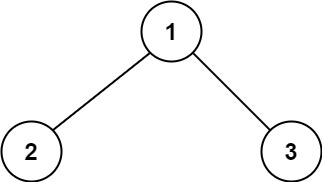
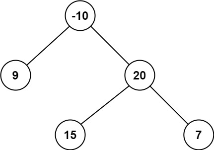

## 124. Binary Tree Maximum Path Sum
Link: https://leetcode.com/problems/binary-tree-maximum-path-sum

### Description:
A path in a binary tree is a sequence of nodes where each pair of adjacent nodes in the sequence has an edge connecting them. A node can only appear in the sequence at most once. Note that the path does not need to pass through the root.  
The path sum of a path is the sum of the node's values in the path.  
Given the root of a binary tree, return the maximum path sum of any non-empty path.  

---

**Example 1:**
  
Input: root = [1,2,3]  
Output: 6  
Explanation: The optimal path is 2 -> 1 -> 3 with a path sum of 2 + 1 + 3 = 6.  

**Example 2:**  
  
Input: root = [-10,9,20,null,null,15,7]  
Output: 42  
Explanation: The optimal path is 15 -> 20 -> 7 with a path sum of 15 + 20 + 7 = 42.  


### Solution: 
```python
# Definition for a binary tree node.
# class TreeNode:
#     def __init__(self, val=0, left=None, right=None):
#         self.val = val
#         self.left = left
#         self.right = right
class Solution:
    def maxPathSum(self, root: Optional[TreeNode]) -> int:
        """
        Time: O(n)
        Space: O(n)
        """
        max_sum = -float('inf')
        
        def traverse(node):
            nonlocal max_sum
            if node is None:
                return 0
            
            left_sum = max(traverse(node.left), 0)
            right_sum = max(traverse(node.right), 0)
            
            max_sum = max(
                max_sum,
                node.val + left_sum + right_sum,
            )
            return max(
                node.val + left_sum,
                node.val + right_sum
            )
        
        traverse(root)
        return max_sum
```
