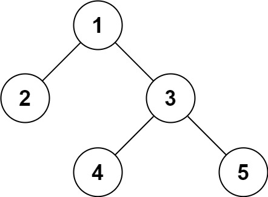

## 297. Serialize and Deserialize Binary Tree
Link: https://leetcode.com/problems/serialize-and-deserialize-binary-tree

### Description:
Serialization is the process of converting a data structure or object into a sequence of bits so that it can be stored in a file or memory buffer, or transmitted across a network connection link to be reconstructed later in the same or another computer environment.

Design an algorithm to serialize and deserialize a binary tree. There is no restriction on how your serialization/deserialization algorithm should work. You just need to ensure that a binary tree can be serialized to a string and this string can be deserialized to the original tree structure.

Clarification: The input/output format is the same as how LeetCode serializes a binary tree. You do not necessarily need to follow this format, so please be creative and come up with different approaches yourself.

---

**Example 1:**
  
Input: root = [1,2,3,null,null,4,5]  
Output: [1,2,3,null,null,4,5]  

**Example 2:**  
Input: root = []  
Output: []  


### Solution: 
```python
# Definition for a binary tree node.
# class TreeNode(object):
#     def __init__(self, x):
#         self.val = x
#         self.left = None
#         self.right = None

class Codec:
    def serialize(self, root):
        """
        Time: O(n)
        Space: O(n)
        """
        def dfs(node, result):
            if node is None:
                result += 'null,'
                return result
            result += f"{node.val},"
            result = dfs(node.left, result)
            result = dfs(node.right, result)
            return result
        result = dfs(root, '')
        return result
        

    def deserialize(self, data):
        """
        Time: O(n)
        Space: O(n)
        """
        if data == '':
            return None
        def restore(vals, i):
            if vals[i] == 'null':
                i += 1
                return None, i
            node = TreeNode(vals[i])
            node.left, j = restore(vals, i + 1)
            node.right, k = restore(vals, j)
            return node, k
        root, _ = restore(data.split(','), 0)
        return root
```
