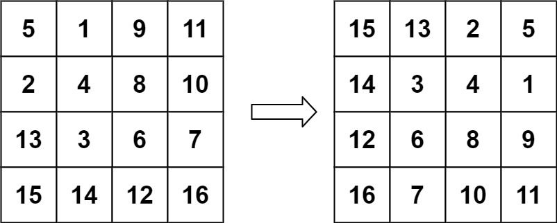

## 48. Rotate Image
Link: https://leetcode.com/problems/rotate-image

### Description: 
You are given an n x n 2D matrix representing an image, rotate the image by 90 degrees (clockwise).

You have to rotate the image in-place, which means you have to modify the input 2D matrix directly. DO NOT allocate another 2D matrix and do the rotation.

---

**Example 1:**  

Input: matrix = [[1,2,3],[4,5,6],[7,8,9]]  
Output: [[7,4,1],[8,5,2],[9,6,3]]  

**Example 2:**  

Input: matrix = [[5,1,9,11],[2,4,8,10],[13,3,6,7],[15,14,12,16]]  
Output: [[15,13,2,5],[14,3,4,1],[12,6,8,9],[16,7,10,11]]  

### Solution: 
```python
import math

class Solution:
    def rotate(self, matrix: List[List[int]]) -> None:
        """
        transpose
        reverse
        Time: O(n)
        Space: O(1)
        """
        self.transpose(matrix)
        self.reverse(matrix)
    
    def reverse(self, matrix):
        N = len(matrix)
        for i in range(N):
            for j in range(N // 2):
                matrix[i][j], matrix[i][N-j-1] = matrix[i][N-j-1], matrix[i][j]

    def transpose(self, matrix):
        N = len(matrix)
        for i in range(N):
            for j in range(1, i+1):
                matrix[i-j][i], matrix[i][i-j] = matrix[i][i-j], matrix[i-j][i]
    
```
