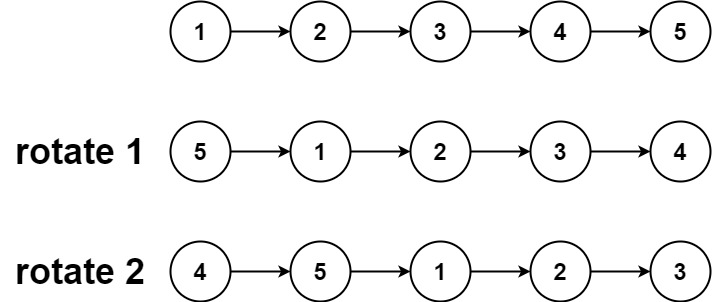
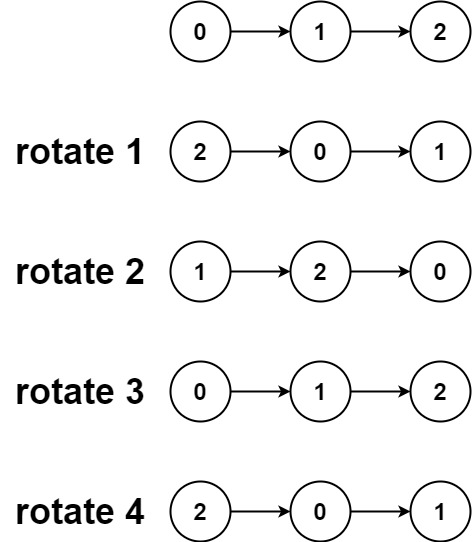

## 61. Rotate List
Link: https://leetcode.com/problems/rotate-list

### Description: 
Given the head of a linked list, rotate the list to the right by k places.

---

**Example 1:**
  
Input: head = [1,2,3,4,5], k = 2  
Output: [4,5,1,2,3]  

**Example 2:**
  
Input: head = [0,1,2], k = 4  
Output: [2,0,1]  

### Solution: 
```python
# Definition for singly-linked list.
# class ListNode:
#     def __init__(self, val=0, next=None):
#         self.val = val
#         self.next = next

class BidirListNode:
    def __init__(self, val=0, next=None, prev=None):
        self.val = val
        self.prev = prev
        self.next = next

class Solution:
    def rotateRight(self, head: Optional[ListNode], k: int) -> Optional[ListNode]:
        """
        Time: O(n + k);
        Space: O(1)
        """
        if head is None:
            return None
        n = 1
        tail = head
        while tail.next is not None:
            tail = tail.next
            n += 1
        
        tail.next = head
        k = k % n

        m = n - k
        while m > 0:
            head = head.next
            tail = tail.next
            m -= 1
        
        tail.next = None
        return head
        
        


    def rotateRight2(self, head: Optional[ListNode], k: int) -> Optional[ListNode]:
        """
        Time: O(n + k mod n)
        Space: O(n)
        """
        if head is None:
            return None

        data = []
        current = head
        while current is not None:
            data.append(current.val)
            current = current.next
        
        k = k % len(data)
        while k > 0:
            val = data.pop()
            data.insert(0, val)
            k -= 1
        
        new_head = ListNode(data[0])
        i = 1
        prev = new_head
        while i < len(data):
            node = ListNode(data[i])
            prev.next = node
            prev = node
            i += 1
        return new_head


    def rotateRight3(self, head: Optional[ListNode], k: int) -> Optional[ListNode]:
        """
        Time: O(n + k mod n);
        Space: O(n)
        """
        if head is None:
            return None
        n = 1
        bidir_head = BidirListNode(head.val)
        bidir_prev = bidir_head
        current = head.next
        while current is not None:
            new_node = BidirListNode(current.val, prev=bidir_prev)
            bidir_prev.next = new_node
            bidir_prev = new_node
            current = current.next
            n += 1
        bidir_tail = bidir_prev

        if bidir_head.next is None:
            return bidir_head

        k = k % n
        while k > 0:
            new_tail = bidir_tail.prev
            bidir_tail.prev.next = None
            bidir_tail.prev = None
            bidir_tail.next = bidir_head
            bidir_head.prev = bidir_tail
            bidir_head = bidir_tail
            bidir_tail = new_tail
            k -= 1
        return bidir_head
```
