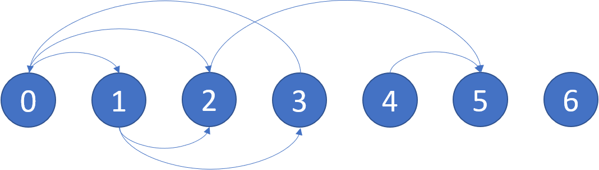

## 802. Find Eventual Safe States
Link: https://leetcode.com/problems/find-eventual-safe-states  

### Description: 
There is a directed graph of n nodes with each node labeled from 0 to n - 1. The graph is represented by a 0-indexed 2D integer array graph where graph[i] is an integer array of nodes adjacent to node i, meaning there is an edge from node i to each node in graph[i].  

A node is a terminal node if there are no outgoing edges. A node is a safe node if every possible path starting from that node leads to a terminal node (or another safe node).  

Return an array containing all the safe nodes of the graph. The answer should be sorted in ascending order.  

---

**Example 1:**  
  
Input: graph = [[1,2],[2,3],[5],[0],[5],[],[]]  
Output: [2,4,5,6]  
Explanation: The given graph is shown above.  
Nodes 5 and 6 are terminal nodes as there are no outgoing edges from either of them.  
Every path starting at nodes 2, 4, 5, and 6 all lead to either node 5 or 6.  

**Example 2:**  
Input: graph = [[1,2,3,4],[1,2],[3,4],[0,4],[]]  
Output: [4]  
Explanation:  
Only node 4 is a terminal node, and every path starting at node 4 leads to node 4.  

### Solution: 
```python
from collections import deque

class Solution:
    def eventualSafeNodes(self, graph: List[List[int]]) -> List[int]:
        q = deque()
        """
        build deps_counter
        build dependenices

        iterate over deps_counter
            if count == 0:
                put into q
        
        while q is not empty
          iterate over dependencies
            decrease deps_counter for dependant nodes
            if deps_counter == 0
                put into q
        
        Time: O(n + m)
        Space: O(n)
        """

        N = len(graph)
        dependencies = [[] for i in range(N)]
        outs_counter = [0] * N
        
        for i, targets in enumerate(graph):
            for target in targets:
                outs_counter[i] += 1
                dependencies[target].append(i)
            if len(targets) == 0:
                q.append(i)
        
        safe_marks = [False] * N
        while len(q) > 0:
            i = q.pop()
            for dep in dependencies[i]:
                outs_counter[dep] -= 1
                if outs_counter[dep] == 0:
                    q.append(dep)
            safe_marks[i] = True

        safe_nodes = []
        for i, safe_mark in enumerate(safe_marks):
            if safe_mark is True:
                safe_nodes.append(i)

        return safe_nodes
```
