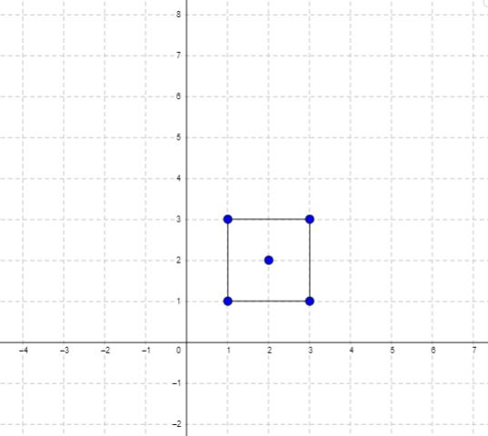
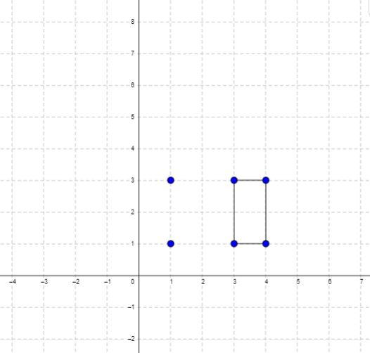

## 939. Minimum Area Rectangle
Link: https://leetcode.com/problems/minimum-area-rectangle

### Description: 
You are given an array of points in the X-Y plane points where points[i] = [xi, yi].

Return the minimum area of a rectangle formed from these points, with sides parallel to the X and Y axes. If there is not any such rectangle, return 0.

---

**Example 1:**  
  
Input: points = [[1,1],[1,3],[3,1],[3,3],[2,2]]  
Output: 4  

**Example 2:**  
  
Input: points = [[1,1],[1,3],[3,1],[3,3],[4,1],[4,3]]  
Output: 2  

### Solution: 
```python
from collections import defaultdict
from functools import lru_cache

class Solution:
    def minAreaRect(self, points: List[List[int]]) -> int:
        seen = set()
        ans = sys.maxsize
        for x1, y1 in points:
            for x2, y2 in points:
                if (x1,y2) in seen and (x2,y1) in seen:
                    ans = min(ans, abs((x2-x1)*(y2-y1)))
            seen.add((x1, y1))
        return ans if ans != sys.maxsize else 0

```
