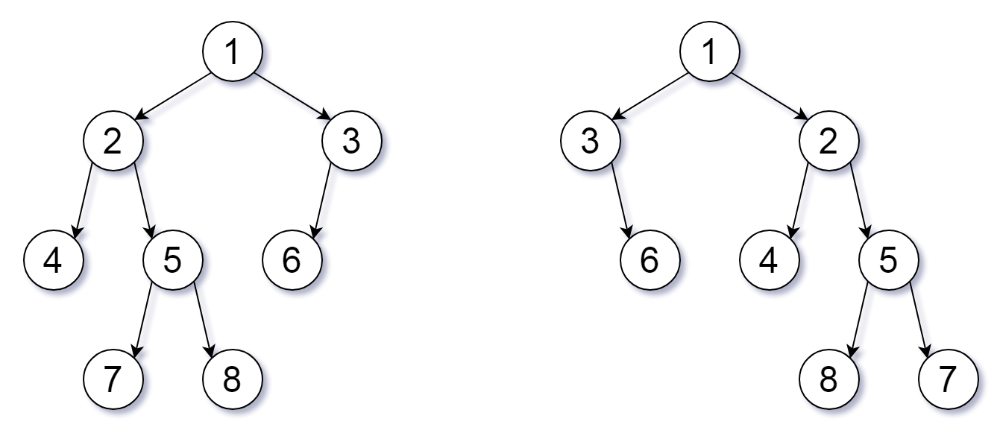

## 951. Flip Equivalent Binary Trees
Link: https://leetcode.com/problems/flip-equivalent-binary-trees

### Description: 
For a binary tree T, we can define a flip operation as follows: choose any node, and swap the left and right child subtrees.

A binary tree X is flip equivalent to a binary tree Y if and only if we can make X equal to Y after some number of flip operations.

Given the roots of two binary trees root1 and root2, return true if the two trees are flip equivalent or false otherwise.

---

**Example 1:**
  
Input: root1 = [1,2,3,4,5,6,null,null,null,7,8], root2 = [1,3,2,null,6,4,5,null,null,null,null,8,7]  
Output: true  
Explanation: We flipped at nodes with values 1, 3, and 5.  

**Example 2:**  
Input: root1 = [], root2 = []  
Output: true  

**Example 3:**  
Input: root1 = [], root2 = [1]  
Output: false  


### Solution: 
```python
# Definition for a binary tree node.
# class TreeNode:
#     def __init__(self, val=0, left=None, right=None):
#         self.val = val
#         self.left = left
#         self.right = right
class Solution:
    def flipEquiv(self, root1: Optional[TreeNode], root2: Optional[TreeNode]) -> bool:
        """
        dfs
        Time: O(min(m, n))
        Space: O(log min(m, n)) || O(min(m,n))
        """
        def check(node1, node2):
            if node1 is None and node2 is None:
                return True
            elif node1 is None or node2 is None:
                return False
            if node1.val != node2.val:
                return False
            
            return ((check(node1.left, node2.right) and
                    check(node1.right, node2.left)) or
                    (check(node1.left, node2.left) and
                    check(node1.right, node2.right)))
        return check(root1, root2)
```
